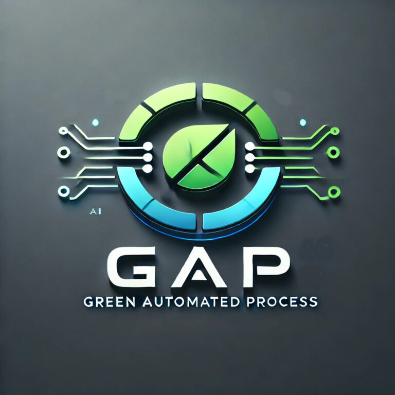

  

# 🌿 GAP System & GAPbot Architecture

**Intelligent Automation for the Physical World | By [Corax CoLAB](https://coraxcolab.com)**

 

*Welcome to the architectural overview of the **Green Automated Platform (GAP)** and the **GAPbot**.*

---

> ⚠️ **Note:** This repository serves as a public architectural overview, documentation hub, and AI context layer (`llms.txt`). The core proprietary source code for the AI models (EcoMind, InnoBrain) and the GAP platform remains in private repositories.

 

## 🚀 The Vision: Full-Stack of Matter

At Corax CoLAB, we don't just design systems; we build them from the ground up to ensure our automated solutions are not just "smart," but ecologically sound. The GAP system optimizes resource flows through a decentralized network of IoT sensors, robust Edge AI, and autonomous robotics.

  
  
<i>The future of Edge AI and ecological automation.</i>

  
  
<i>The modern React/Vite based Mission Control dashboard for real-time fleet monitoring and teleoperation.</i>

 

### 🧠 The GAP Platform (Mission Control)

The nervous system of the operation has been significantly upgraded. Our new Mission Control dashboard features a suite of world-class capabilities:

* 📊 **Live Telemetry (`Telemetry.tsx`):** Real-time monitoring of system vitals, battery life, structural integrity, and network status.
* 📷 **Vision Stream (`VisionStream.tsx`):** High-definition, low-latency video feed directly from the GAPbot's edge sensors with bounding boxes for detected objects via YOLOv8.
* 🗺️ **Lidar Map (`LidarMap.tsx`):** Real-time 2D/3D point cloud rendering for precise situational awareness, generated by the onboard Lidar array.
* 🤖 **Digital Twin (`DigitalTwin.tsx`):** A real-time synchronized 3D representation of the GAPbot's physical state, kinematics, and orientation, allowing for predictive modeling and remote inspection.
* 🔗 **Web3 Audit Ledger (`AuditLedger.tsx`):** A verifiable, immutable log of critical events, safety stops, and sensor data anchored to a blockchain using quantum-resistant algorithms, ensuring absolute data integrity.
* ☁️ **Edge-First AI:** Inference runs locally. The system syncs SQLite data to a cloud (Supabase) orchestrator only when connectivity is available.
* 🎯 **Mission Orchestrator:** Translates high-level human goals ("Scan Sector A") into actionable robotic commands via MQTT.

 

### 🕷️ GAPbot: The Hexapod Explorer

The physical extension of the GAP ecosystem. GAPbot is a six-legged autonomous robot designed for challenging terrains where wheeled robots fail.

* **Hardware Core:** Powered by a Raspberry Pi 5 (16GB RAM) with active cooling, running headless via SSH/VNC.
* **AI Acceleration:** Equipped with a Hailo-8L NPU over PCIe for real-time vision processing (YOLOv8) and environmental analysis without relying on the cloud.
* **High-Speed I/O:** NVMe SSD connected via PCIe/USB 3.1 for rapid database logging and sensor telemetry.
* **Autonomy:** Runs on ROS 2 (Jazzy Jalisco) with RTK-GPS and Lidar for precision navigation and obstacle avoidance.
* **Actuation:** 18 servos controlled via I2C (PCA9685) managed by custom inverse kinematics algorithms.

---

## 📚 Documentation

Dive deeper into the GAP ecosystem architecture and specifications:

| Topic | Description |
|---|---|
| 🏗️ [**Platform Architecture**](./docs/01-platform-architecture.md) | The Edge-First approach, cloud synchronization, Web3 data integrity, and mission control components. |
| ⚙️ [**Hardware Specifications**](./docs/02-hardware-specs.md) | Core compute, AI acceleration, kinematics, and power systems of the GAPbot. |
| 👁️ [**AI & Vision**](./docs/03-ai-and-vision.md) | Real-time processing, object detection, and the EcoMind & InnoBrain modules. |
| 🤖 [**AI Context Layer**](./docs/llms.txt) | Detailed structural overview and context optimized for LLMs. |
| 🎮 [**Mission Control**](./mission-control/README.md) | Setup and details for the React/Vite based mission control frontend. |

---

## 🛠️ High-Level Tech Stack

<b>Click to expand</b>

 

* **Frontend & Mission Control:** React, TypeScript, Vite, TailwindCSS, WebGL/Three.js (for Digital Twin & Lidar).
* **Languages & Frameworks:** Python (FastAPI, PyTorch), C++, Node.js.
* **Robotics & Autonomy:** ROS 2 (Jazzy Jalisco), rclpy, custom kinematics.
* **Hardware Interfaces:** PCIe, I2C, SPI, UART/Serial, GPIO (`RPi.GPIO`, `gpiozero`).
* **Communication & IoT:** Paho-MQTT, WebSockets, Supabase.
* **AI & Vision:** YOLOv8, Hailo-8L NPU, OpenCV.
* **Security & Integrity:** Web3 Audit Ledger, Quantum-Resistant Cryptography (`liboqs-python`).

---

## 🤝 Collaborate with Corax CoLAB

  

Corax CoLAB is led by **Pelle Nyberg**—Deep Tech Developer, AI & Robotics Innovator, and Master Gardener. With a unique background spanning industrial quality management, forestry, and hardware-level coding, Corax CoLAB brings a holistic approach to Deep Tech and AgTech.

**We are open to:**
* 🚀 Consulting projects and technical partnerships.
* 🤖 New opportunities in AI & Robotics Development (Python/Linux/ROS).
* 🏗️ Deep Tech & IoT Architecture design.
* 🌱 GreenTech Innovation & Strategy.

  <h3>Let's build the future together.</h3>
  
  

 

  <i>Intelligent Automation. Harmonizing the natural world with the digital one.</i>

