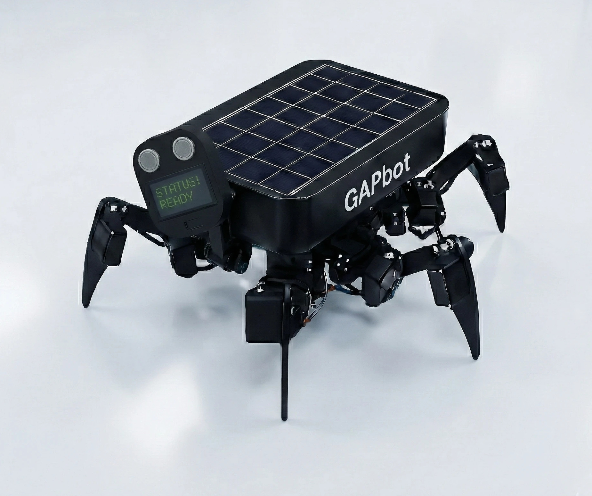

# ⚙️ Hardware Specifications: GAPbot

  

The GAPbot is a six-legged (hexapod) robotic platform designed for complex, unstructured terrains. The hardware stack is chosen for maximum throughput, edge AI capabilities, and precise physical actuation.

  

## Core Compute Node
* **Processor:** Raspberry Pi 5 (16GB RAM)
* **Storage:** 1TB NVMe SSD connected via PCIe / USB 3.1 for high-I/O database operations and fast boot times.
* **Cooling:** Active onboard fan management for sustained heavy processing loads.
* **Environment:** Runs headless (Ubuntu/Linux) managed via SSH and VNC.

## AI Acceleration
* **NPU:** Hailo-8L Neural Processing Unit connected via PCIe.
* **Throughput:** Delivers real-time inference (e.g., YOLO object detection) with minimal power draw, offloading the CPU entirely for kinematic calculations.

## Kinematics & Actuation
* **Servos:** 18 individual high-torque servos (3 per leg).
* **Control Interface:** Driven via I2C utilizing the PCA9685 PWM driver.
* **Locomotion:** Custom inverse and forward kinematics algorithms translate high-level directional commands into precise multi-leg gaits.

## Sensory Input & Navigation
* **Vision:** High-resolution camera modules routed directly through the Hailo-8L.
* **Spatial Awareness:** Integration of Lidar for local obstacle avoidance and RTK-GPS for high-precision global positioning.
* **Telemetry:** I2C/SPI sensors (e.g., BMP280, ADS1115) for environmental monitoring.
